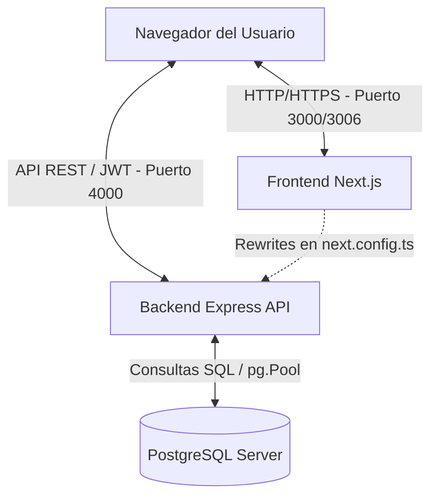

# Arquitectura Técnica - Tablero de Recursos y Empleo (COPA)

Este documento detalla la arquitectura de software, el flujo de comunicación y el diseño técnico del sistema para asegurar el correcto mantenimiento, escalabilidad y seguridad.

---

## 1. Visión General (High-Level Architecture)

El sistema está estructurado como una aplicación **SPA (Single Page Application)** moderna bajo una arquitectura desacoplada en dos componentes principales de Node.js:

1. **Frontend (Next.js)**: 
   - Procesa la interfaz de usuario en el lado del cliente (React/TypeScript).
   - Se comunica dinámicamente con la API REST para renderizar los datos frescos sin necesidad de compilaciones periódicas estáticas.
2. **Backend (Express API)**: 
   - Servidor Node.js ligero que expone las rutas RESTful en el puerto 4000.
   - Gestiona la seguridad (autenticación JWT), la auditoría de accesos automática, y realiza consultas directas y agregaciones analíticas sobre la base de datos PostgreSQL.

---

## 2. Flujo de Comunicación y Configuración de Red

### A. Proxy Reverso y Enrutamiento (Rewrites)
Para simplificar la configuración del lado del cliente y evitar problemas de CORS (Cross-Origin Resource Sharing) en producción, el frontend de Next.js configura un sistema de **Rewrites** en su archivo de configuración [`next.config.ts`](file:///c:/Users/USER/Desktop/Codigos/Trabajo_IPECD/Copa/apps/web/next.config.ts):

- **Ruta de Base (basePath)**: `/copa`
- **Enrutamiento de API**: Cualquier petición hacia `/copa/copa-api/:path*` o `/copa-api/:path*` es reescrita internamente en el servidor hacia la URL del backend: `http://localhost:4000/:path*`.
- **Efecto**: El navegador realiza peticiones al mismo dominio y puerto del frontend, y Next.js actúa como proxy reverso transparente hacia el backend.

### B. Consumo de API Seguro (`fetchWithAuth`)
El frontend realiza peticiones HTTP asíncronas utilizando la función auxiliar [`fetchWithAuth`](file:///c:/Users/USER/Desktop/Codigos/Trabajo_IPECD/Copa/apps/web/src/lib/api.ts):
1. Recupera el token del usuario desde el `localStorage` (`copa_token`).
2. Agrega automáticamente la cabecera `Authorization: Bearer <token>` a cada solicitud.
3. Intercepta las respuestas con código de estado **401 Unauthorized**: si el token ha expirado o es inválido, limpia el `localStorage` y redirige inmediatamente al usuario a la página de login (`/login`).

---

## 3. Autenticación y Autorización

El acceso a las secciones ejecutivas del tablero está protegido mediante un esquema de **JSON Web Tokens (JWT)**:

1. **Autenticación (Login)**:
   - El usuario envía sus credenciales al endpoint `/api/auth/login`.
   - El backend busca el usuario en la tabla `public.usuarios_tableros` verificando que esté activo (`activo = true`) y tenga el permiso correspondiente (`tablero_acceso = 'coparticipacion'`).
2. **Seguridad y Cifrado de Contraseñas**:
   - Las contraseñas se almacenan y validan utilizando **Bcrypt**.
   - **Lógica de Migración Gradual**: Si la base de datos contiene una contraseña en formato de texto plano y el login coincide, la API valida el acceso y, de forma transparente, genera un Hash de Bcrypt seguro, actualizando el registro en la base de datos (`UPDATE public.usuarios_tableros SET password_hash = $1 WHERE id_usuario = $2`).
3. **Generación de Token**:
   - Tras el login exitoso, se genera un JWT firmado con la clave privada (`JWT_SECRET`) y con un tiempo de expiración preestablecido de **8 horas**.
   - El token almacena el `id_usuario`, `username` y `role`.
4. **Middleware de Protección**:
   - Las rutas privadas del backend se protegen mediante el middleware [`auth.js`](file:///c:/Users/USER/Desktop/Codigos/Trabajo_IPECD/Copa/apps/api/middleware/auth.js), que decodifica y valida la firma del JWT e inyecta la información del usuario en el objeto de petición (`req.user`).

---

## 4. Telemetría y Registro de Auditoría

El sistema cuenta con un sistema de auditoría exhaustivo para registrar el uso del tablero:

### A. Auditoría Automática (Middleware)
El backend utiliza el middleware [`activityLogger`](file:///c:/Users/USER/Desktop/Codigos/Trabajo_IPECD/Copa/apps/api/middleware/logger.js) en todas las peticiones:
- Inyecta una función helper `req.logAction`.
- Permite a los endpoints de la API registrar interacciones de forma automática en la tabla `public.coparticipacion_registros`.
- Captura de forma segura:
  - Identificador de usuario (`id_usuario`).
  - Acción / Ruta solicitada (`GET /api/personal/masa-salarial`).
  - Dirección IP del cliente (`ip_cliente`).
  - Metadatos en formato JSON (parámetros de consulta, parámetros de ruta y cuerpo de peticiones POST/PUT).

### B. Telemetría de Interfaz de Usuario
Para las acciones que ocurren puramente en el cliente y no generan consultas a la base de datos (por ejemplo, alternar entre vistas, clics en filtros, descargas de reportes):
- El frontend utiliza el Hook personalizado [`useAnalytics`](file:///c:/Users/USER/Desktop/Codigos/Trabajo_IPECD/Copa/apps/web/src/hooks/useAnalytics.ts).
- Este hook realiza una petición POST hacia `/api/analytics/log`.
- Cuenta con lógica de **Deduplicación (dedupe)** de 1000 ms para evitar registros duplicados causados por clics múltiples rápidos o por el modo estricto de React.

---

## 5. Hosting y Control de Procesos (PM2)

En entornos de producción, la ejecución y estabilidad de ambas aplicaciones (Frontend y API) se controlan de forma centralizada con el administrador de procesos **PM2** mediante el archivo de configuración [`ecosystem.config.js`](file:///c:/Users/USER/Desktop/Codigos/Trabajo_IPECD/Copa/ecosystem.config.js):

- **`copa-web`** (Frontend):
  - Directorio de trabajo: `apps/web`
  - Comando: `npm start`
  - Puerto asignado: **3006**
- **`copa-api`** (Backend):
  - Directorio de trabajo: `apps/api`
  - Comando: `node index.js`
  - Puerto asignado: **4000**

PM2 se encarga de reiniciar las aplicaciones ante caídas del servidor, gestionar los registros de salida (`logs`) y facilitar los despliegues sin tiempo de inactividad.
